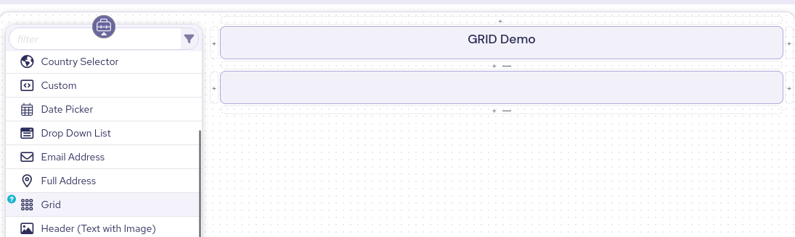
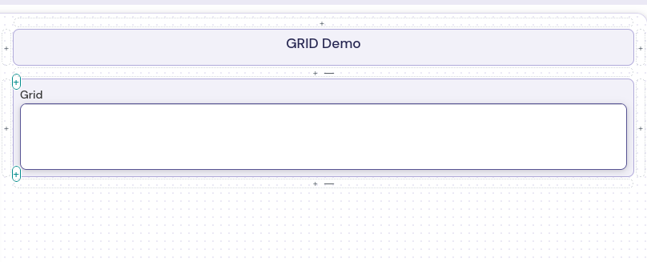

The grid element is a display only element.

When making the grid you are asked to create columns.  Each of the colums have a programmtic name and a size relative to the screen

Filling the grid is done from JSON.  You can either fill it from the default value menu or an action/conditon as a part of the form, which could call a workflow. 

