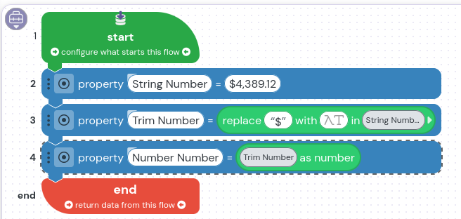

iPaaS does not have an inherint currenty format that I have been able to find. 

In order to make people feel like they are working with currency, on forms have a regex of ^\$\d{1,3}(,\d{3})*(\.\d{2})?$
applied to a string field.  Run the follow flow steps to work with the string as a number.

